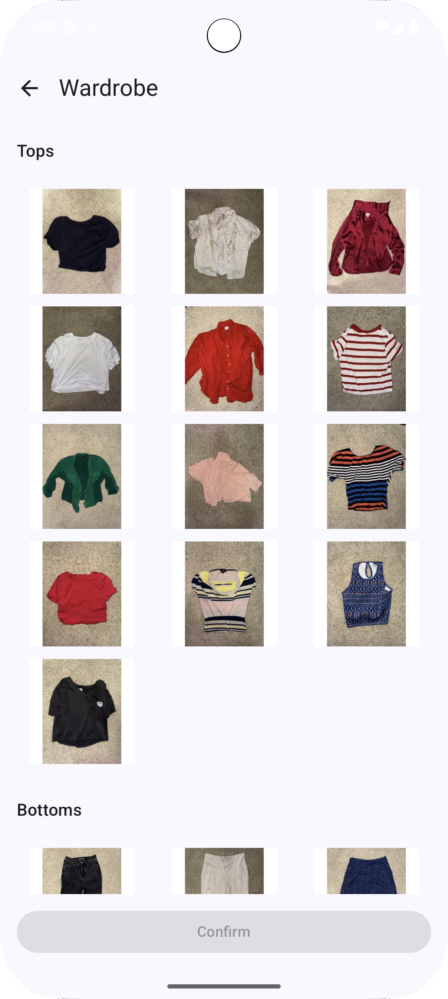
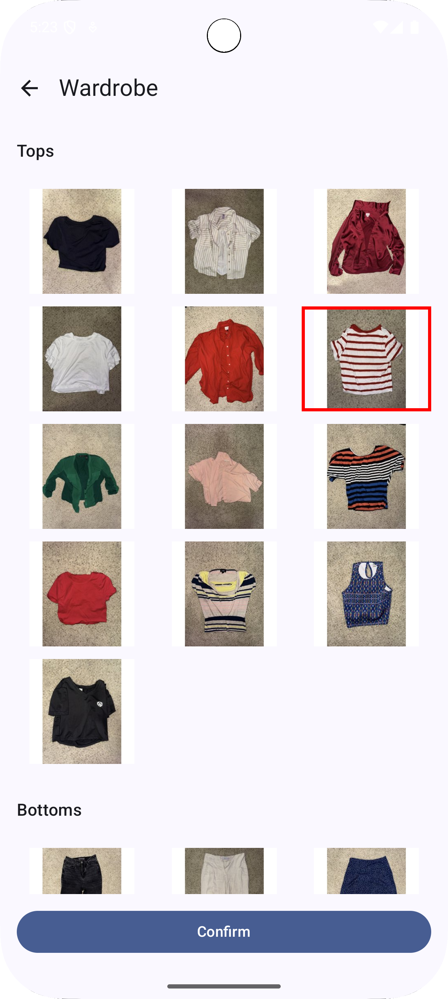
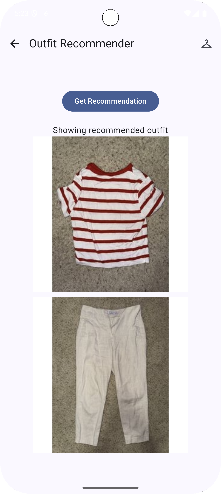

# Clothing Recommendation App

This is the demo version for showcasing, developed for a specific user and is a work in progress based on the user feedback.

## Overview

An Android app for recommending outfit pairings (currently top and bottom piece), combining a mobile front-end with a machine learning backend.  
The system uses vision transformers (ViT) with LLM head to extract attributes from images.  
These attributes are then used to train a deep neural network (DNN) to map attributes to user preferences.  
Resulting DNN is converted to TensorFlow Lite and integrated into an Android app for local, on-device recommendations.

## 📱 App Screenshots

### Home Screen / Recommendation based on general user preference

### Wardrobe View

### Select an Item

### Recommended with User Preferred Item

## Data Flow

Images are preprocessed and passed to a ViT + LLM, which returns structured JSON attributes.  
These attributes are paired into labeled combinations for neural network training, exported as .tflite.

## Results
Labeled samples: 62  (80/20 train/test split)

Test Accuracy: 1.00  
Precision: 1.00  
Recall: 1.00  
F1 Score: 1.00  

The analysis demonstrates:

The system successfully filters out all combinations the user would dislike — no false positives.  
It correctly includes all combinations the user would favor — no false negatives.  
These results indicate that the system meets the user’s requirements with perfect performance on the test set.  

# License

This project is proprietary. All rights reserved. Commercial use is not permitted without prior written consent.

# Notes

This project could be a great gift for your partner/friend so if you would like to use it for that end only, you have my blessings. You will need:  
1. Your own OpenAI API or open-source ViT and LLM.
2. Your own assets.
3. DNN trained on your assets.
